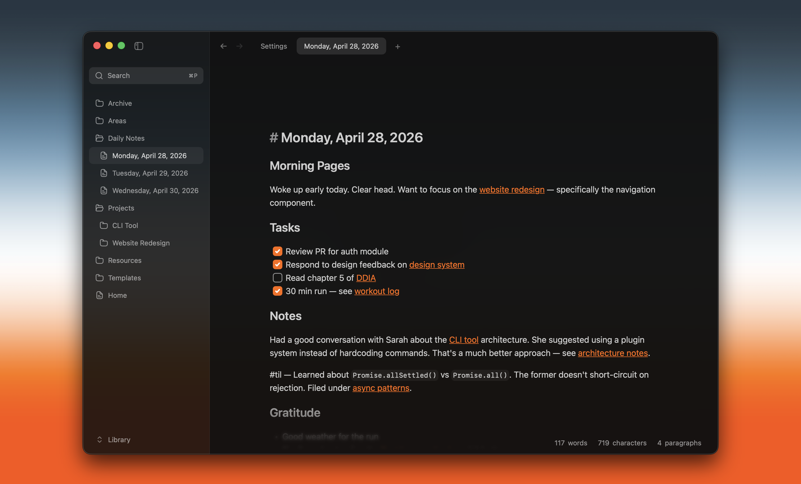

# Writer

Fast and lightweight local app for reading and editing Markdown and MDX files in a workspace.



It is built with Tauri v2, React, Zustand, TipTap, and Rust. The app keeps documents on disk, respects workspace `.gitignore` rules, supports multiple windows, and ships through an ad-hoc-signed macOS release flow.

Writer is a general Markdown/MDX surface. It no longer includes Madinah blog publishing, Properties/frontmatter forms, in-app Preferences, the former provider-specific AI toolkit, or remote asset upload configuration.

An AI-first Assistant built on user-managed Agent Client Protocol runtimes is an approved product direction but is not implemented in the current release. Its product and architecture contract lives in [`SPECs/ai-first-acp-assistant-spec.md`](./SPECs/ai-first-acp-assistant-spec.md).

## Fork Notice

This repository is a customized fork of [Writer Computer](https://github.com/joelbqz/writer-computer).

The original project copyright belongs to its original authors. This fork contains modifications by the maintainers of this repository beginning on 2026-07-05.

This fork is independently maintained. Issues, releases, binaries, and support for this fork are handled by this repository's maintainers.

## Changes From Upstream

This fork may include changes to product direction, desktop app behavior, release configuration, branding, and local development workflow.

Release-level changes are tracked in [CHANGELOG.md](./CHANGELOG.md). Implementation notes and feature specs live in [SPECs/](./SPECs/).

## License

This fork is distributed under the GNU General Public License v3.0. See [LICENSE](./LICENSE).

The full corresponding source code for released binaries is available from this repository through the matching Git tag or release archive.

The software is provided without warranty to the extent permitted by GPLv3.

## Repository

- `src/` — React frontend.
- `src-tauri/src/` — Rust commands, workspace state, watcher, and CLI integration.
- `shared/` — schema and theme contracts consumed by both frontend and backend.
- `tests/` — frontend unit tests.
- `e2e/` — local macOS WebDriver smoke tests.
- `docs/` — project and agent workflow docs.
- `SPECs/` — feature specs and design notes.

## Development

This repo uses Vite+ through the `vp` CLI. Use `vp` instead of calling the package manager or Vite tooling directly.

```bash
vp install
vp dev
```

## Validation

```bash
vp check
vp test
```

Rust validation runs from the Tauri crate:

```bash
cd src-tauri
cargo test
cargo clippy
cargo fmt --check
```

## Releases

macOS releases are built with ad-hoc signing by the Writer Release GitHub Actions workflow when a version tag is pushed. Writer does not update itself; install newer versions manually from GitHub Releases. See `docs/releasing.md` for the short release checklist.
